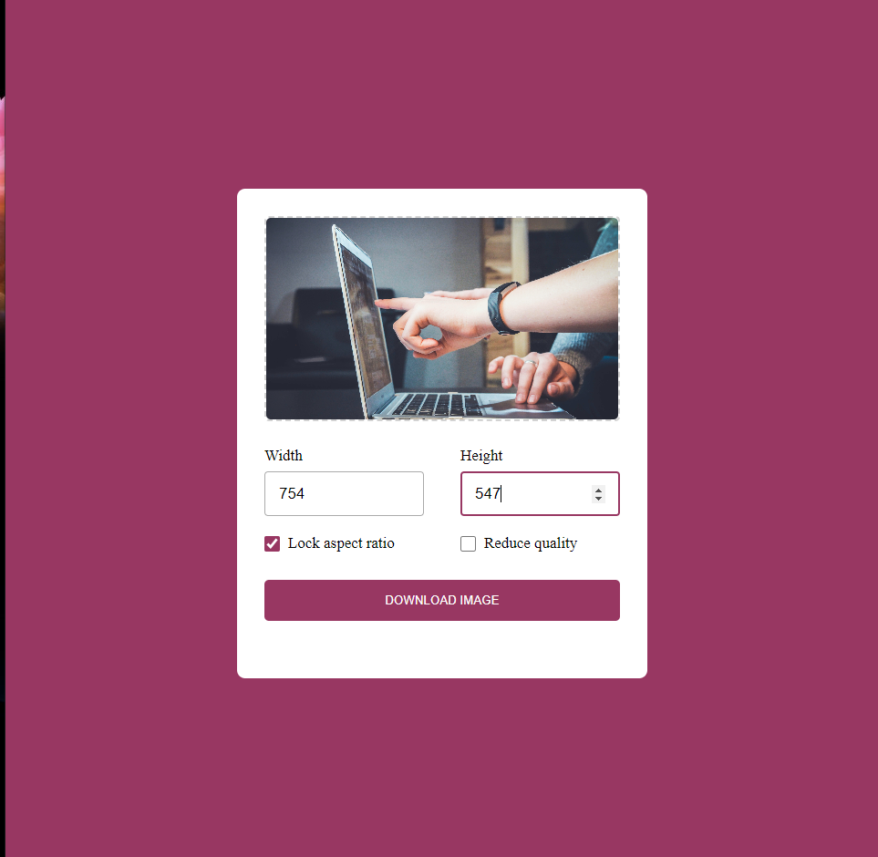

# Resize-image-app

## Welcome to Resize Image App repository 👋

Amazing that you're here my friend!!

This web app takes an image from the user and resize it depending on the width and height that the user enters.

Beside that, user can lock the aspect ratio and can reduce the quality of the image.

## The Code

The App built with `HTML, CSS and JavaScript`.
Feel free to clone the repo and try it locally.

## Demo version

You can try the app here 👉 [Demo](https://roudi22.github.io/resize-image-app/)

**HAPPY CODING 🦾**
